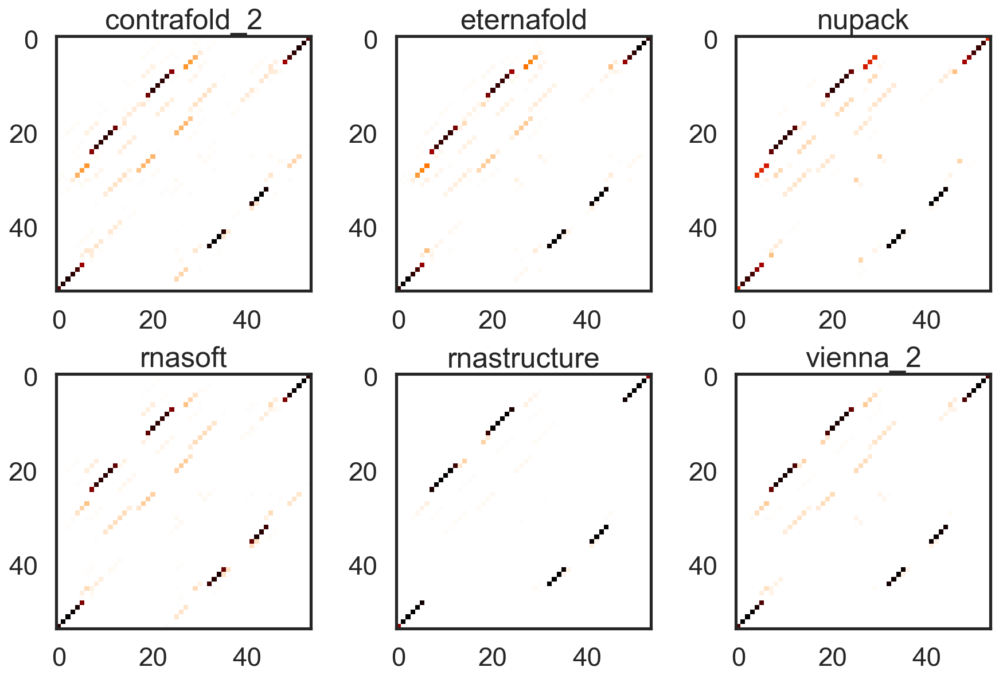
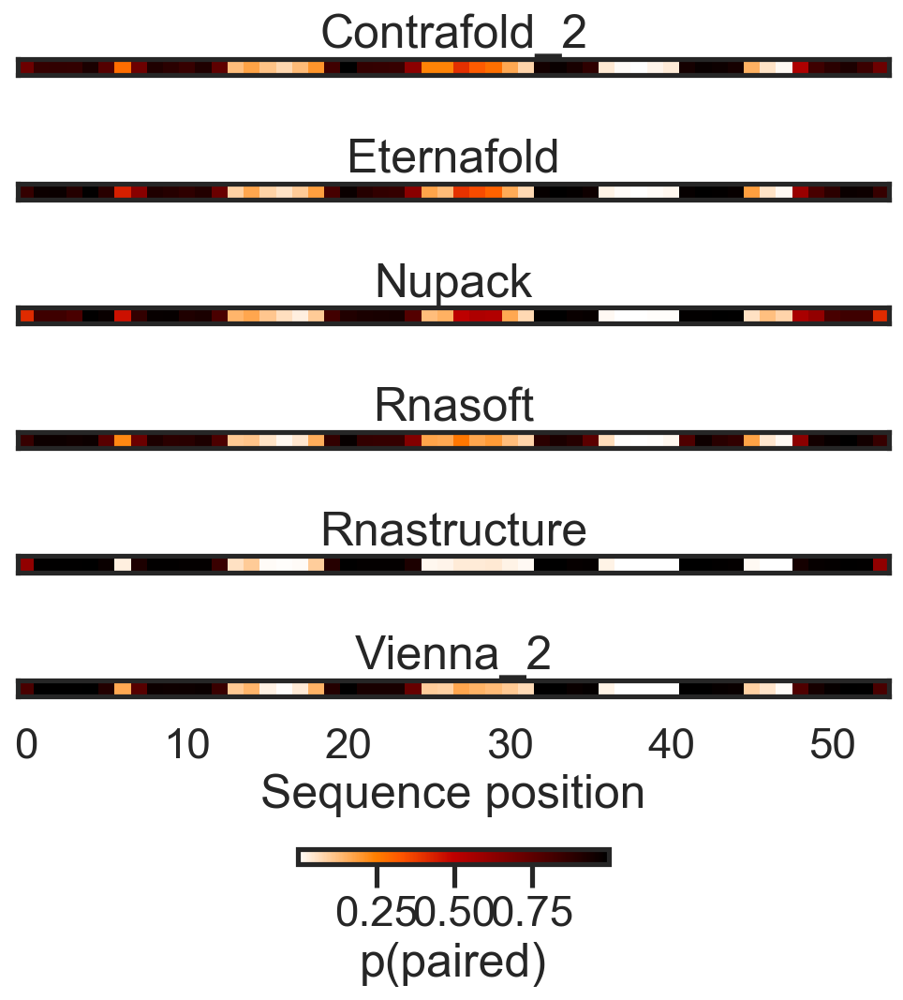

# arnie
Python API to compute RNA energetics and do structure prediction from all available packages.

(c) 2020 Leland Stanford Jr University

Authors:
Hannah Wayment-Steele

## Organization:

`notebooks`: example jupyter notebooks with usage.

`scripts`: scripts for processing sequences in batch.

`parameter_files`: dir of various parameter files for packages, put here out of convenience.

`test`: unit tests (still in work)

`mea`: code for computing Maximum Expected Accuracy structures.

`RNAGraph`: Code to process secondary structures as graph objects (here until a better repo location becomes clear)

## Usage:

Start by creating a file that points to your builds of all the structure prediction packages you wish to use.  An example file is provided in `example_arnie_file.txt`.  Create a variable in your .bashrc for this:

```
export ARNIEFILE="/path/to/arnie/<my_file.txt>"
```
NB: this file is technically yaml format, but isn't read in by yaml.

See `examples/start_here.ipynb` for example syntax. In brief, comparing across packages is simple. For computing base pairing probability matrices:

```
from arnie.bpps import bpps

bpps={}

for pkg in ['vienna','nupack','RNAstructure','contrafold','RNAsoft']:
    bpps[package] = bpps(my_sequence, package=pkg)
```


Can also analyze as average base pairing per nucleotide:




## Coming soon

Pointers for compiling packages
