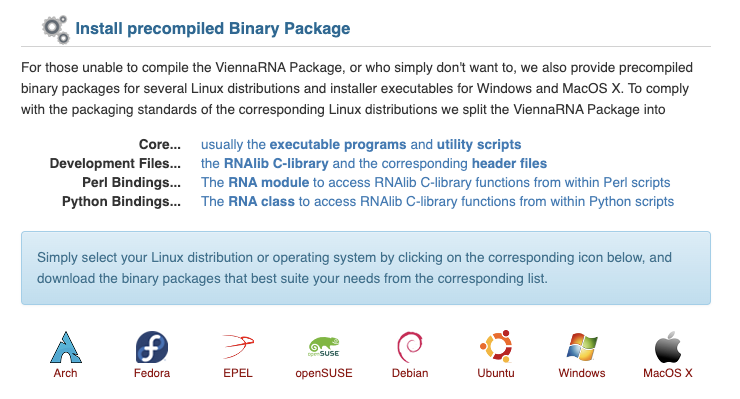

# Getting set up with Arnie

Arnie is a set of wrappers to call other packages. So in order for Arnie to work right, we have to do a little bit of lifting at the start to 1) download and compile those packages, and 2) tell Arnie where they are in your arnie file.

Below is a set of notes with instructions / tips for installing packages on Mac and Linux. There are many more ways to do this! This is just what I (HKWS) have found to work and have recently tested.

You don't have to install all of the packages described here for arnie to work. At a minimum, setting up Vienna is required. Beyond that, your needs will dictate what other packages you set up.

- More accurate thermodynamic predictions? Set up EternaFold

- SHAPE-directed structure prediction? Set up Vienna or RNAstructure

- Benchmarking packages / skeptic of all?  Set up all of them!

This document contains instructions to download, compile where needed, and set paths for all the major packages and versions that Arnie supports. This document does not describe the python syntax -- for that, go to `notebooks/start_here.ipynb`.

At the end of the day you'll have an example arnie file that looks like this:

```
# Vienna RNAfold 2 Mac using installer:
vienna_2: /usr/local/bin

# NUPACK build:
nupack: /path/to/nupack3.0.6/src/bin

# CONTRAfold build
contrafold_2: /path/to/contrafold-se/src

# RNASoft build
rnasoft: /path/to/MultiRNAFold

# RNAstructure (precompiled command line src)
rnastructure: /path/to/RNAstructure/exe

# Path to EternaFold
eternafold: /path/to/EternaFold/src

# (DEPRECATED, better to put path to Eternafold)
# Path to EternaFold parameters
eternafoldparams: /path/to/EternaFold/parameters/EternaFoldParams.v1

# LinearFold build
linearfold: /path/to/LinearFold/bin

#LinearPartition build
linearpartition: /path/to/LinearPartition/bin

#directory to write temp files
TMP: /path/to/TMP/dir
```

## Vienna RNAFold (Arnie default)

### Existing binaries:

(I use this for Mac.)

Download a precompiled binary from [https://www.tbi.univie.ac.at/RNA/#download](https://www.tbi.univie.ac.at/RNA/#download) .



Click on the icon of your OS to download the installer, and click through the installer. This should install the Vienna executables to `/usr/local/bin`. Check by navigating there and trying to run `RNAfold -h`.

Then set in the arnie file:

```
# Vienna RNAfold 2 Mac using installer:
vienna_2: /usr/local/bin
```

### Compile from source:

(I use this for linux.)

Download the source code from [https://www.tbi.univie.ac.at/RNA/#download](https://www.tbi.univie.ac.at/RNA/#download) :


```
gunzip ViennaRNA-2.4.14.tar.gz
tar -xvf ViennaRNA-2.4.14.tar
cd ViennaRNA-2.4.14
./configure --prefix /path/to/vienna/bin # make this where you want the executables to be installed
make install
```

I get errors about not being able to find `EXTERN.H` from perl wrappers, but the executable builds still work.

Check the build by navigating to `/path/to/vienna/bin` and running `RNAfold -h`.

Then set in the arnie file:

```
# Vienna RNAfold 2 Linux build from source:
vienna_2: /path/to/ViennaRNA-2.4.14/src/bin
```

## EternaFold (`package='eternafold'`)

Go to [https://eternagame.org/about/software](https://eternagame.org/about/software). Follow the instructions under "Request License" under EternaFold to download.


If you get the following error:
```
Utilities.cpp:342:17: error: use of undeclared identifier 'mkdtemp'
```
Try adding `#include <unistd.h>` to `Utilities.hpp`.

To check the build, try running `./contrafold`.

Set in your arnie file:

```
#Path to EternaFold
eternafold: /path/to/EternaFold/src
```

## NUPACK (`package='nupack'`)

Download from [http://www.nupack.org/downloads](http://www.nupack.org/downloads). (Requires registering to sign a license agreement).

Notes: I have found that NUPACK 3.2.2 does not work on Mac, and instead use NUPACK 3.0.6 on Mac. Nupack 3.2.2 works on linux though. 

```
cd nupack3.0.6
make
```

Check build by running `./bin/mfe -h`.

Then set in arnie file:

```
# NUPACK build:
nupack: /path/to/nupack3.0.6/src/bin
```

## CONTRAfold 2 (`package='contrafold'`)

I recommend downloading the code that is at [https://github.com/csfoo/contrafold-se](https://github.com/csfoo/contrafold-se).  Even though this is named CONTRAfold-SE, the repo itself does not contain any of the parameter files from the CONTRAfold-SE project, and the authors cleaned up some build issues. If you run this code with its default parameters, you are running CONTRAfold 2.

```
git clone https://github.com/csfoo/contrafold-se.git
cd contrafold-se/src
make
```

If you get the following error:
```
Utilities.cpp:342:17: error: use of undeclared identifier 'mkdtemp'
```
Try adding `#include <unistd.h>` to `Utilities.hpp`.

To check the build, try running `./contrafold`.

Then set in arnie.rc:

```
# CONTRAfold build
contrafold_2: /path/to/contrafold-se/src
```

## RNAStructure (`package='rnastructure'`)

Download RNAstructure (pre-compiled command-line interface) for your OS from [https://rna.urmc.rochester.edu/RNAstructure.html](https://rna.urmc.rochester.edu/RNAstructure.html).


Unzip the tarball and test the executables in `RNAstructure/exe` by running `./partition -h`.

Add to Arnie file:

```
# RNAstructure (precompiled command line src)
rnastructure: /path/to/RNAstructure/exe
```

## RNASoft (`package='rnasoft'`)

Download the MultiRNAFold package from [http://www.rnasoft.ca/download.html](http://www.rnasoft.ca/download.html). (Tested for version 2.1, 2018).

Unzip the MultiRNAfold tarball.

For Mac:

May need to copy this `malloc.h` into the `include` dir: [https://opensource.apple.com/source/Libc/Libc-825.26/include/malloc/malloc.h.auto.html](https://opensource.apple.com/source/Libc/Libc-825.26/include/malloc/malloc.h.auto.html).

Then type

```
make depend
make
```

To check build, try `./simfold -h`. Then put in arnie file:

```
#RNASoft build
rnasoft: /path/to/MultiRNAFold
```

There are additional parameter files for other types of training that can be downloaded at [https://www.cs.ubc.ca/~andrones/param-training/](https://www.cs.ubc.ca/~andrones/param-training/). 

Here's a zipped version of my param file for convenience: 

[HKWS_rnasoft_param_repo.zip](doc_ASSETS/HKWS_rnasoft_param_repo.zip)

## LinearFold and LinearPartition  (`linear=True`)

Several arnie tools have the option to use LinearFold or LinearPartition to speed up calculation for long RNAs.  To set this up, download the following repos:

In `pfunc`, `mfe`, `bpps`, use the arg `linear=True`. This works for `package='vienna'` or `package='contrafold'`.

```
git clone https://github.com/LinearFold/LinearFold.git
cd LinearFold
make
cd ..
git clone https://github.com/LinearFold/LinearPartition.git
cd LinearPartition
make
```

add to arnie file:

```
# LinearFold build
linearfold: /path/to/LinearFold/bin

#LinearPartition build
linearpartition: /path/to/LinearPartition/bin
```

## the TMP dir

Last but not least, you'll need to create a directory somewhere where your system calls to all of these packages will be deleting temporary files and then deleting them. Add to arnie file:

```
#directory to write temp files
TMP: /path/to/TMP/dir
```
